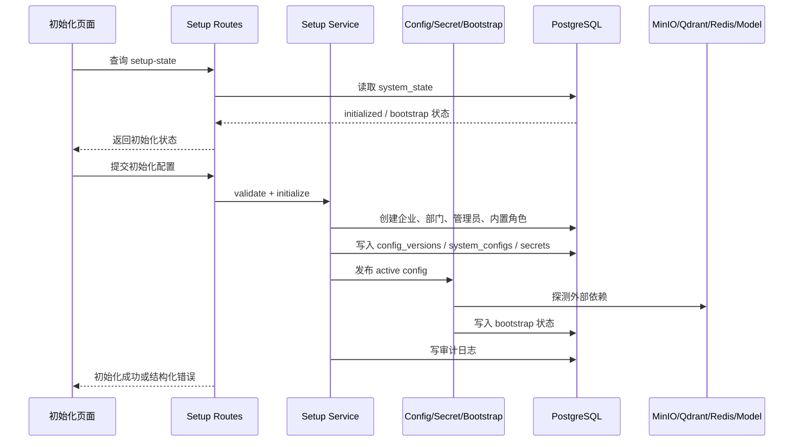
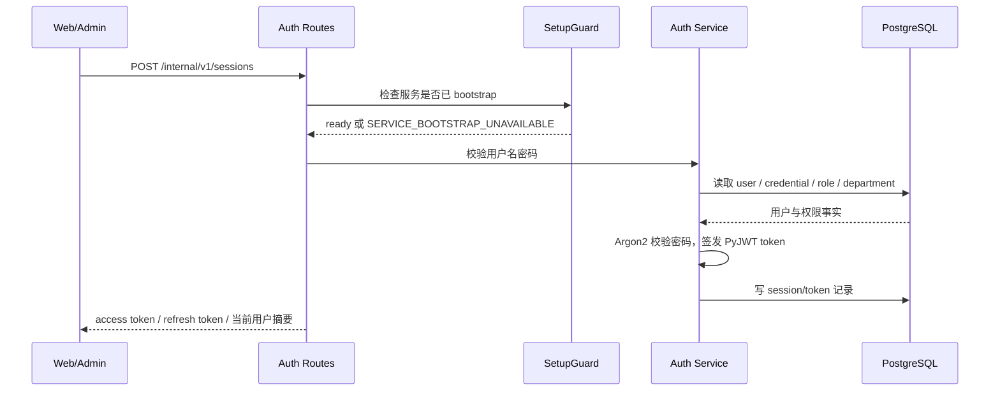
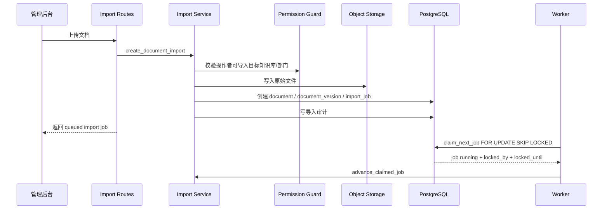
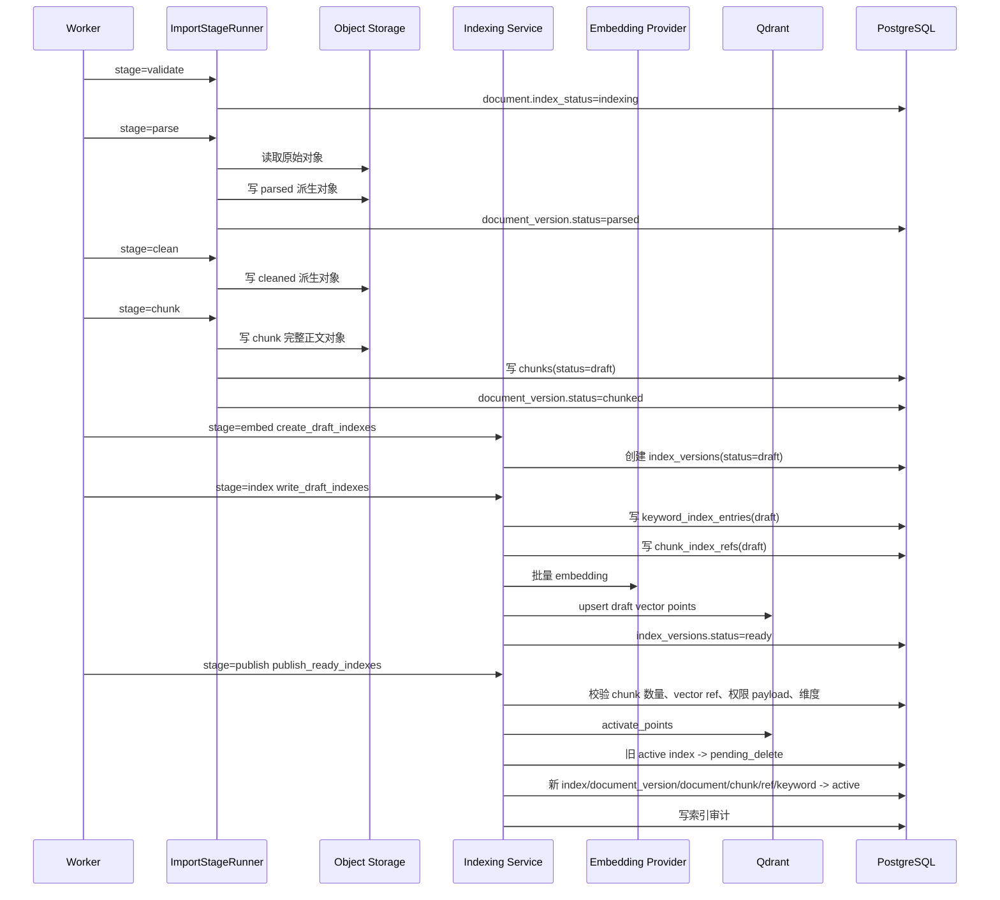
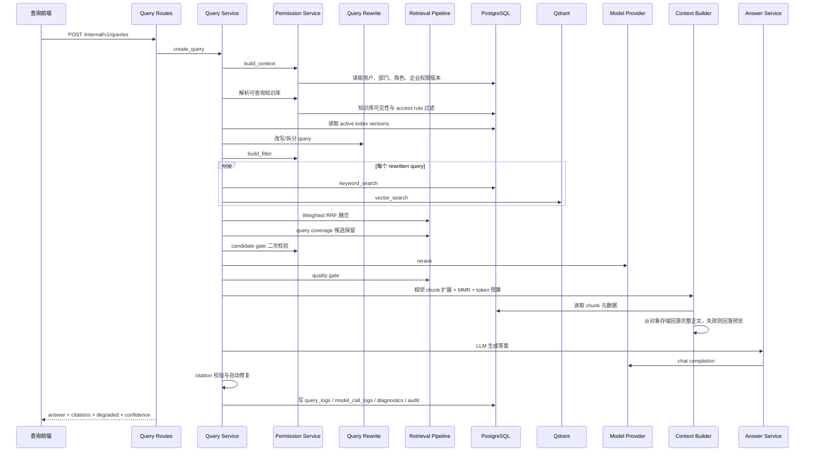
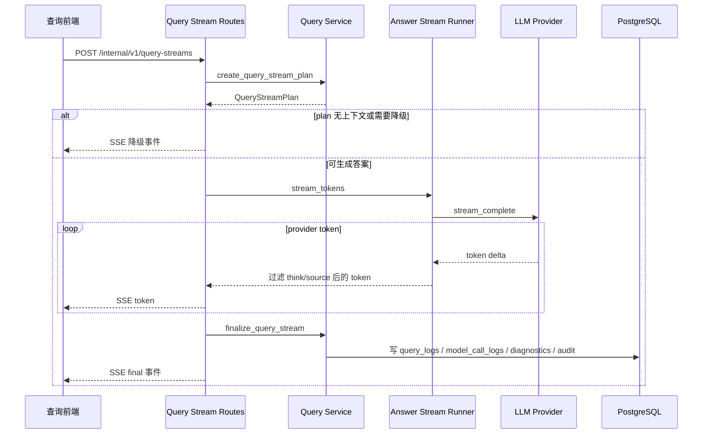
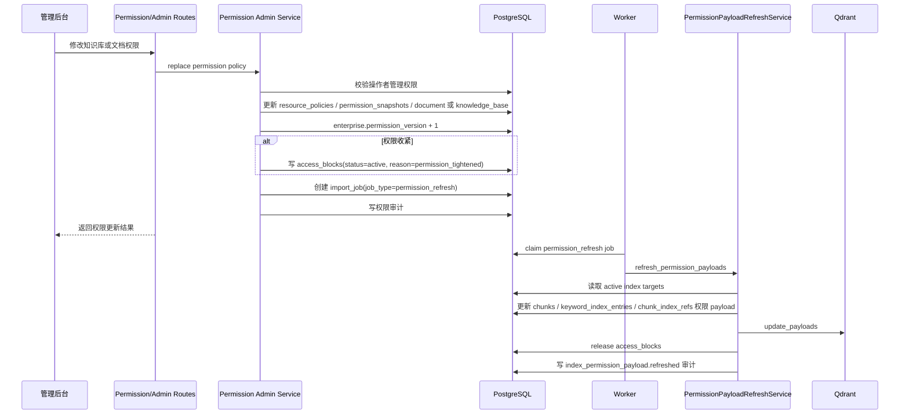

# 核心业务链路时序图

更新时间：2026-06-03

本文用时序图说明 Little Bear 当前核心业务链路。图中只保留关键调用、状态变化、权限校验、审计和降级点，不展开字段级细节。

## 1. 系统初始化链路

关键状态：

- 未初始化时，只允许访问 setup 和健康检查相关接口。
- 初始化成功后必须存在 active config。
- initialized=true 但 active config 或关键依赖不可用时，普通业务 API 进入拒绝模式。

## 2. 登录鉴权链路

关键状态：

- 用户必须 active。
- 普通员工可登录普通查询前端，但不能进入管理后台。
- 管理后台菜单隐藏不作为权限边界；每个后端接口仍要做 scope 校验。

## 3. 文档导入链路

关键状态：

- 上传成功只代表任务创建成功，不代表文档已可查询。
- `import_jobs.status` 初始为 `queued`，Worker 领取后变为 `running`。
- Worker 通过 `locked_by` 和 `locked_until` 控制并发处理和锁接管。

## 4. 导入阶段与索引发布链路

关键状态：

- draft chunk、draft keyword、draft vector point 对查询不可见。
- 只有 `index_versions.status=active`、`documents.lifecycle_status=active`、`documents.index_status=indexed`、`chunks.status=active`、`chunk_index_refs.visibility_state=active` 的组合才允许进入查询。
- publish 前任一校验失败，都不得激活新索引。

## 5. 普通非流式查询链路

降级点：

- 无可访问知识库：返回 `query_scope_empty` 降级。
- 无 active index：返回 `active_index_empty` 降级。
- 向量召回失败：保留关键词召回。
- rerank 失败：使用融合排序。
- LLM 失败：返回可解释降级和引用。
- citation 失败：抑制或修复答案，不直接返回模型原文。

## 6. 流式查询链路

关键状态：

- 流式输出期间会过滤 `<think>` 和 `[source:...]` 内部来源占位。
- 最终仍要走 citation 校验、日志写入和审计写入。
- 流式失败时返回结构化 SSE 错误或降级事件。

## 7. 权限变更后的索引刷新链路

关键状态：

- 权限收紧先写 access block，避免旧索引继续命中。
- payload 刷新完成后才释放 `permission_tightened` access block。
- 查询候选还会二次检查 access block、document/chunk/index 状态和权限版本。

