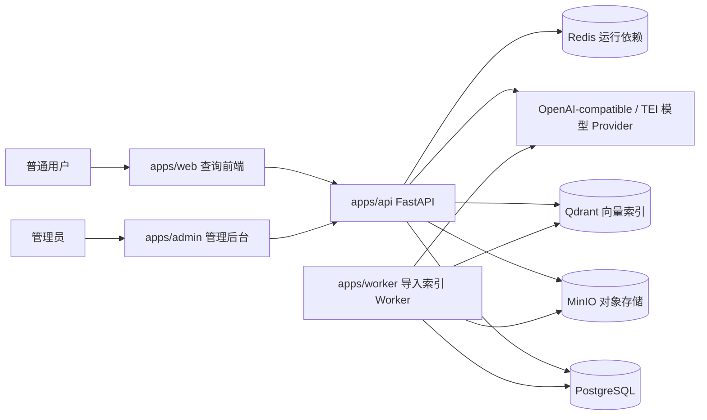

# 项目总体架构设计书

更新时间：2026-06-03

本文基于当前代码实现整理 Little Bear 的系统架构。它只说明系统组成、职责边界和依赖方向，不重复接口字段和具体代码实现。

## 1. 系统定位

Little Bear 是企业内部知识检索与问答系统，核心目标是：

- 让普通用户只能检索自己有权限访问的知识库和文档。
- 让管理员可以管理组织、用户、知识库、文档、导入任务、索引和诊断日志。
- 让导入、索引、查询和权限变更在失败时可重试、可审计、可恢复。
- 让模型服务、向量库或重排服务不可用时，系统能够结构化降级，而不是直接泄露错误或返回无依据答案。

## 2. 系统上下文



## 3. 组件职责

| 组件 | 当前职责 | 不承担的职责 |
| --- | --- | --- |
| `apps/web` | 普通用户登录、知识库选择、会话列表、流式/非流式问答、引用与降级状态展示 | 不做权限判定；不做本地检索；不保存密钥 |
| `apps/admin` | 初始化、配置、组织用户、知识库文档、导入任务、索引运维、日志诊断 | 不替代后端权限控制；不在前端假分页代替后端筛选 |
| `apps/api` | HTTP 入口、认证、权限上下文、业务服务编排、查询链路、管理能力、日志审计 | 不执行长耗时导入索引循环；route 层不直接调用 Qdrant/MinIO/模型 SDK |
| `apps/worker` | 领取导入/索引/权限刷新任务，推进 parse、clean、chunk、embed、index、publish 阶段 | 不暴露 HTTP API；不调用 FastAPI route function |
| `PostgreSQL` | 业务事实源：组织、权限、配置、任务、文档、chunk、索引账本、日志和审计 | 不保存大段原始文件和完整 chunk 正文 |
| `MinIO` | 原始上传文件、解析结果、清洗结果、chunk 完整正文等对象 | 不作为权限事实源 |
| `Qdrant` | 向量召回派生索引，payload 携带权限过滤字段 | 不作为文档生命周期事实源 |
| `Redis` | 当前作为基础设施依赖参与 bootstrap；后续可承载缓存、锁、通知等派生运行能力 | 当前尚未实现最终答案缓存业务闭环 |
| 模型 Provider | embedding、rerank、LLM、query rewrite 可选模型调用 | 不参与权限决策 |

## 4. 后端分层与依赖方向

当前后端是模块化单体，API 与 Worker 共用业务模块。代码依赖方向应保持单向：

```text
api/routes
  -> api/dependencies / api/schemas / api/presenters
  -> modules/<domain> service/facade
  -> repository / policy / runtime / shared / db
  -> adapters / external systems

apps/worker
  -> modules/import_pipeline runtime/service
  -> modules/indexing service/runtime
```

### 4.1 API route 层

`api/routes` 只负责：

- 接收 HTTP 参数和请求体。
- 注入认证用户、分页参数、request_id、trace_id。
- 调用 service/facade。
- 捕获模块错误并转换为统一错误响应。
- 调用 presenter 裁剪展示字段。

route 层不应直接：

- 写复杂 SQL。
- 构造 Qdrant、MinIO、模型 provider。
- 决定业务权限。
- 长时间持有数据库事务执行外部 IO。

### 4.2 Domain module 层

`modules/<domain>` 是业务规则与事务编排的核心。当前主要模块包括：

- `auth`：登录、JWT、会话、密码。
- `setup`：初始化、bootstrap、配置发布。
- `config`：配置版本、激活、归档、校验。
- `secrets`：密钥保存与读取。
- `admin`：管理后台领域能力。
- `permissions`：RBAC、知识库访问、文档可见性、candidate gate。
- `knowledge`：普通用户可见知识库、文档和来源读取。
- `import_pipeline`：导入任务、Worker 状态机、解析清洗切块。
- `indexing`：draft index、active publish、权限 payload 刷新、索引运维。
- `query`：查询编排、召回融合、rerank、日志和诊断。
- `query_rewrite`：问题改写和联合问题拆分。
- `retrieval`：检索候选、融合、重排和质量门。
- `context`：LLM 上下文构建。
- `answer`：LLM 回答生成与流式输出。
- `audit`：审计日志、查询日志、模型调用日志读取。
- `models`：模型网关 HTTP 客户端。
- `storage`：对象存储抽象与运行时构造。

### 4.3 Repository / Runtime / Adapter

- `repository.py` 负责 SQL 读写和数据装配，不构造 API response。
- `runtime.py` 根据 active config、secret 和外部系统参数组装 service / adapter。
- `adapters` 封装 Qdrant 等外部协议差异，不读业务数据库。
- `shared` 只放通用工具，如日志、时间、分页、JSON、JWT、request_id。

## 5. API 与 Worker 边界

导入链路采用异步任务模式：

1. API 校验请求、权限、文件大小和幂等键。
2. API 创建 `import_jobs`、`documents`、`document_versions` 等事实记录。
3. API 将原始文件写入对象存储。
4. Worker 通过 `claim_next_job` 领取任务并持有锁。
5. Worker 分阶段推进 parse、clean、chunk、embed、index、publish、cleanup。
6. Worker 失败时写入错误、释放锁并按 retryable 与 max_attempts 决定是否重试。

这个边界避免上传接口长时间阻塞，也避免多个 Worker 重复处理同一任务。

## 6. PostgreSQL 事实源定位

PostgreSQL 是所有业务判断的事实源：

- 组织、用户、角色、权限版本。
- active config 和 Secret 引用。
- 知识库、文档、文档版本、chunk。
- index version、keyword index entry、chunk index ref。
- import job、query log、model call log、audit log。
- access block 与 permission snapshot。

Qdrant、MinIO、Redis 和关键词索引都不能单独决定业务可见性。查询候选最终必须回到 PostgreSQL 或已由 PostgreSQL 写入的权限 payload 做校验。

## 7. 外部依赖定位

### 7.1 MinIO

MinIO 保存大对象：

- 原始上传文件。
- parsed / cleaned 派生文本。
- chunk 完整正文。

数据库只保存 object key、预览、hash、页码、标题路径和 source offsets。

### 7.2 Qdrant

Qdrant 保存向量 point。每个 point 的 payload 包含：

- enterprise、knowledge base、document、chunk、index version。
- owner department、visibility。
- document/index/chunk 状态。
- visibility_state 和 indexed_permission_version。

Qdrant 只做召回，不替代二次权限校验。

### 7.3 Redis

Redis 当前作为基础设施依赖被纳入 bootstrap 检查。最终答案缓存、分布式限流、配置通知等业务缓存能力尚未形成完整闭环。

### 7.4 模型 Provider

模型 provider 分为：

- embedding：生成查询向量和文档向量。
- rerank：对候选片段重排。
- LLM：生成答案或执行 query rewrite。

模型调用日志只记录 route、耗时、token、hash 和错误摘要，不保存完整 prompt 或文档原文。

## 8. 前端职责边界

### 8.1 普通查询前端

普通查询前端负责：

- 登录与 token refresh。
- 拉取当前用户可访问知识库。
- 会话列表、消息展示、删除会话。
- 发送查询请求并消费 SSE token。
- 展示引用、置信度和降级原因。

普通查询前端不负责：

- 判断文档是否可见。
- 拼接权限过滤条件。
- 本地合并多个知识库结果。

### 8.2 管理后台

管理后台负责：

- 管理端能力入口和页面状态。
- 后端分页列表展示。
- 新增、编辑、删除、激活、归档等操作提交。
- 文档导入、权限配置、索引运维和日志诊断。

管理后台隐藏菜单只是用户体验，不是安全边界。后端必须对每个接口重新做 scope、部门、知识库和资源权限检查。

## 9. 安全与降级原则

- 权限、删除、索引和缓存必须 fail closed。
- draft index、deleted document、blocked document、archived index 不得进入查询上下文。
- 模型生成答案必须经过 citation 校验。
- citation 校验失败时抑制原答案或结构化降级。
- embedding 失败可降级关键词召回。
- rerank 失败可降级融合分数排序。
- LLM 失败返回可解释的降级结果和引用，不返回无依据答案。
- 高风险写操作必须记录审计。

