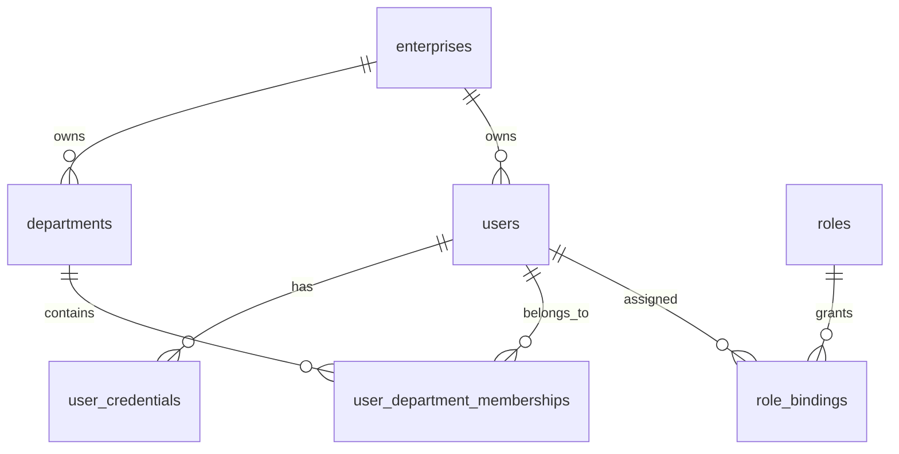
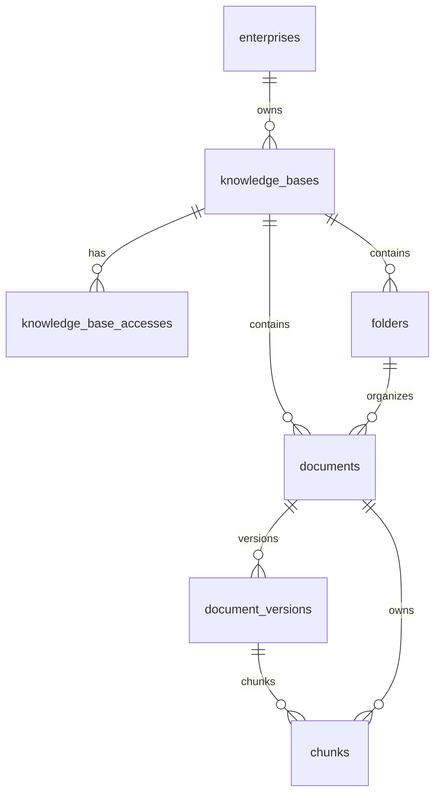
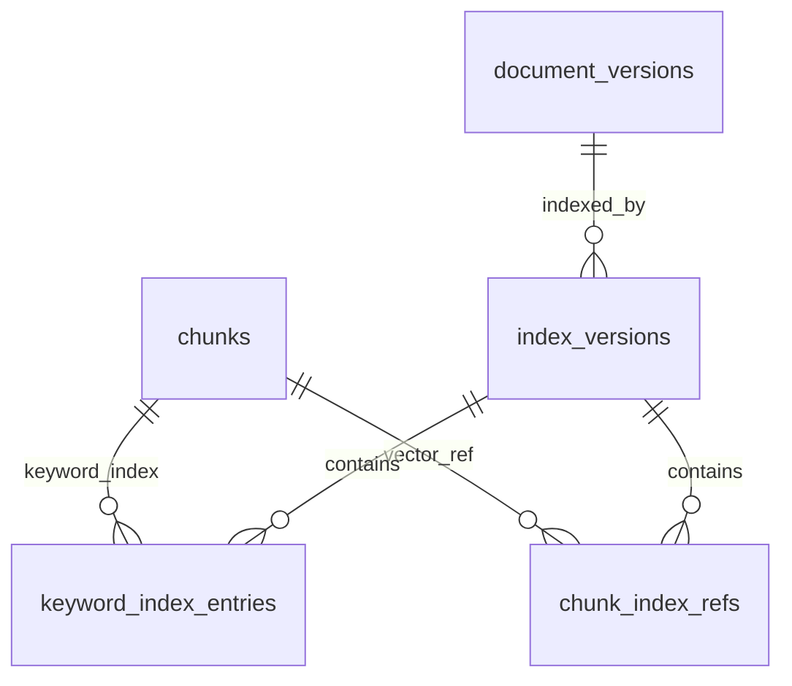

# 领域模型与数据关系说明

更新时间：2026-06-03

本文解释 Little Bear 当前主要业务实体、数据关系、事实源和派生账本。字段枚举以当前数据库迁移和后端代码为准。

## 1. 数据分层

当前数据模型分为三类：

| 类型 | 说明 | 典型表 |
| --- | --- | --- |
| 业务事实源 | 决定业务状态、权限和生命周期的事实 | `enterprises`、`users`、`knowledge_bases`、`documents`、`document_versions`、`chunks`、`index_versions`、`import_jobs` |
| 派生账本 | 由事实源派生，但查询和恢复依赖它们追踪外部状态 | `keyword_index_entries`、`chunk_index_refs`、`query_cache_entries` |
| 诊断与审计 | 记录行为、降级、模型调用、检索诊断和高风险操作 | `audit_logs`、`query_logs`、`model_call_logs`、`query_retrieval_diagnostics` |

PostgreSQL 是唯一业务事实源。MinIO、Qdrant、Redis 和模型 provider 都不是权限和生命周期事实源。

## 2. 组织与账号模型

### 2.1 企业

`enterprises` 是租户边界。权限上下文、知识库、文档、任务、日志和审计都必须带 `enterprise_id`。

关键字段：

- `status`：企业必须 active 才能构建权限上下文。
- `org_version`：组织结构版本。
- `permission_version`：权限版本，权限变化后递增，用于权限过滤 hash 和索引 payload 刷新。

### 2.2 用户与凭据

`users` 保存账号主体，`user_credentials` 保存密码哈希。登录后由 `auth` 模块签发 JWT，并在 token 相关表中记录会话状态。

关键字段：

- `users.status`：非 active 用户不能构建权限上下文。
- `users.deleted_at`：软删除用户不可参与登录和权限判断。

### 2.3 部门成员关系

`user_department_memberships` 是用户和部门的多对多关系。权限上下文会读取 active 成员关系，并用于文档 `department` 可见性判断。

### 2.4 角色与角色绑定

`roles.scopes` 保存 RBAC scope。`role_bindings` 将角色绑定给用户，并带作用域类型与作用域 ID。

当前权限上下文会合并：

- 基础用户 scope：`auth:session`、`auth:password:update:self`。
- 所有 active 角色绑定中的 `roles.scopes`。

## 3. 知识库与文档模型

### 3.1 知识库

`knowledge_bases` 是文档组织容器。它决定知识库是否可发现、可选择、可管理，但不直接决定其中每个文档是否可读。

关键字段：

- `status`：`active`、`disabled`、`archived`、`deleted`。
- `owner_department_id`：管理归属，不等于访问边界。
- `kb_visibility`：知识库可见性，支持 `enterprise`、`department_acl`、`private`。
- `default_document_visibility`：新导入文档默认可见性，支持 `department`、`enterprise`。
- `default_document_owner_department_id`：新文档默认归属部门。
- `policy_version`：知识库权限策略版本。

### 3.2 知识库访问对象

`knowledge_base_accesses` 记录非企业可见知识库的访问对象。

关键字段：

- `subject_type`：`department`、`user`、`role`。
- `subject_id`：对应部门、用户或角色 ID。
- `permission`：`discover`、`query`、`manage`。
- `status`：`active`、`revoked`。

如果知识库 `kb_visibility=enterprise`，查询权限判断可直接通过知识库可见性；否则需要命中 active access rule。

### 3.3 文件夹

`folders` 只负责知识库内层级组织。当前 `policy_inherit_mode` 固定为 `inherit`，文件夹不是独立权限模型的主要载体。

### 3.4 文档

`documents` 是查询可见性的核心事实表。

关键字段：

- `kb_id`：所属知识库。
- `folder_id`：所属文件夹，可为空。
- `current_version_id`：当前 active 文档版本。
- `lifecycle_status`：`draft`、`active`、`archived`、`deleted`。
- `index_status`：`none`、`indexing`、`indexed`、`index_failed`、`blocked`。
- `owner_department_id`：文档归属部门。
- `visibility`：`department`、`enterprise`。
- `permission_snapshot_id`：当前权限快照。

只有 `lifecycle_status=active` 且 `index_status=indexed` 的文档可以进入查询候选。

### 3.5 文档版本

`document_versions` 记录文档内容版本。

关键字段：

- `version_no`：同一文档内递增。
- `object_key`：原始文件对象。
- `parsed_object_key`：解析后文本对象。
- `cleaned_object_key`：清洗后文本对象。
- `parser_version`、`chunker_version`：处理链路版本。
- `status`：`draft`、`parsed`、`chunked`、`indexed`、`active`、`archived`、`failed`。

同一文档只能有一个 active 版本，避免 citation 回溯出现多义性。

### 3.6 Chunk

`chunks` 是 RAG 上下文和 citation 的最小业务单元。

关键字段：

- `document_version_id`：所属文档版本。
- `ordinal`：版本内顺序。
- `text_object_key`：完整 chunk 正文对象。
- `text_preview`：列表和候选召回摘要。
- `heading_path`：标题路径。
- `page_start`、`page_end`：页码范围。
- `source_offsets`：块范围、字符偏移、标题路径、切块策略等元数据。
- `content_hash`：chunk 内容 hash。
- `status`：`draft`、`active`、`archived`、`deleted`。

查询上下文优先通过 `text_object_key` 从对象存储读取完整正文，失败时回落到 `text_preview`。

## 4. 索引模型

### 4.1 索引版本

`index_versions` 管理 draft / ready / active 索引发布。

关键字段：

- `embedding_model`、`model_version`、`dimension`：embedding 版本与维度。
- `collection_name`：Qdrant collection。
- `status`：`draft`、`ready`、`active`、`archived`、`pending_delete`、`failed`。
- `chunk_count`：预期 chunk 数。
- `permission_snapshot_hash`：发布时的权限快照 hash。
- `payload_hash`：索引 payload hash。

同一文档只能有一个 active index。新索引失败不得影响旧 active index。

### 4.2 关键词索引账本

`keyword_index_entries` 是 PostgreSQL Full Text 派生索引，同时携带权限过滤字段：

- `owner_department_id`
- `visibility`
- `visibility_state`
- `indexed_permission_version`
- `payload_hash`

关键词召回必须下推企业、文档状态、chunk 状态、index 状态、文档可见性、部门和 access block 条件。

### 4.3 Chunk Index Ref

`chunk_index_refs` 是 Qdrant point、关键词索引和 chunk 之间的事实账本。

关键字段：

- `vector_id`：Qdrant point ID。
- `keyword_id`：关键词索引记录。
- `visibility_state`：`draft`、`active`、`blocked`、`deleted`。
- `indexed_permission_version`：索引 payload 对应的权限版本。
- `payload_hash`：payload 完整性 hash。

查询只允许命中 `visibility_state=active` 的 ref。

## 5. 权限快照与阻断模型

### 5.1 权限快照

`permission_snapshots` 保存某个资源发布到索引时使用的权限 payload。文档和 chunk 会引用它，以便索引发布前后验证 payload 一致性。

典型用途：

- draft index 创建时写入 permission snapshot hash。
- publish 前校验 `index_versions.permission_snapshot_hash` 是否仍等于当前文档权限快照。
- 权限变更时刷新 active index payload。

### 5.2 Access Block

`access_blocks` 是删除和权限收紧的 fail-closed 边界。

关键字段：

- `resource_type`：支持 `knowledge_base`、`folder`、`document`、`chunk` 等资源。
- `resource_id`：被阻断资源。
- `reason`：`deleted`、`permission_tightened`、`legal_hold`、`security_incident`。
- `block_level`：`query`、`citation`、`all`。
- `status`：`active`、`released`。

查询和 citation 校验都会检查 active access block。权限收紧时先写 block，再异步刷新索引 payload，刷新完成后释放 block。

## 6. 导入任务模型

`import_jobs` 是 Worker 领取任务和阶段推进的事实源。

关键字段：

- `job_type`：`upload`、`url`、`metadata_batch`、`index_rebuild`、`permission_refresh`、`index_delete`。
- `status`：`queued`、`running`、`retrying`、`partial_success`、`success`、`failed`、`cancelled`。
- `stage`：`validate`、`parse`、`clean`、`chunk`、`embed`、`index`、`publish`、`cleanup`、`finished`。
- `request_json`：任务输入和阶段派生结果。
- `attempt_count`、`max_attempts`：重试控制。
- `locked_by`、`locked_until`：Worker 锁。
- `next_retry_at`：重试调度时间。

Worker 通过 `FOR UPDATE SKIP LOCKED` 领取可运行任务，避免并发重复处理。

## 7. 查询与诊断模型

### 7.1 Query Log

`query_logs` 记录一次查询的质量、权限版本、索引版本和降级结果，不保存完整 query 明文。

关键字段：

- `request_id`、`trace_id`。
- `user_id`、`kb_ids`。
- `query_hash`。
- `status`、`degraded`、`degrade_reason`。
- `config_version`、`permission_version`、`permission_filter_hash`、`index_version_hash`。
- `candidate_count`、`citation_count`。

### 7.2 Model Call Log

`model_call_logs` 记录模型路由、耗时、token 摘要和 hash。

不记录：

- 完整 prompt。
- 文档原文。
- secret。
- token 明文。

### 7.3 Retrieval Diagnostics

`query_retrieval_diagnostics` 记录检索诊断：

- rewrite queries。
- 各阶段候选数量。
- quality gate 结果。
- selected chunks。

它用于管理后台诊断，不替代 query log 审计事实。

### 7.4 会话消息

`query_conversations` 和 `query_messages` 是普通用户查询前端的会话展示模型。

它们保存用户可见的会话窗口和消息，不替代 `query_logs`、`model_call_logs`、`audit_logs`。

## 8. 审计模型

`audit_logs` 是高风险操作、拒绝访问、降级和管理动作的审计事实源。

关键字段：

- `event_name`
- `actor_type` / `actor_id`
- `resource_type` / `resource_id`
- `action`
- `result`
- `risk_level`
- `config_version`
- `permission_version`
- `index_version_hash`
- `summary_json`
- `error_code`

权限收紧、索引发布、导入失败、查询降级、管理写操作都应写入审计或诊断日志。

## 9. 查询可见性关键字段

一个 chunk 能进入最终上下文，至少要满足：

- `documents.enterprise_id` 等于当前用户企业。
- 知识库在当前用户可查询范围内。
- `documents.lifecycle_status = active`。
- `documents.index_status = indexed`。
- `chunks.status = active`。
- `index_versions.status = active`。
- `chunk_index_refs.visibility_state = active`。
- 文档 `visibility=enterprise`，或 `visibility=department` 且 `owner_department_id` 属于当前用户部门。
- 不存在 active access block。
- 候选未命中过期或不匹配的 active index version。

