# Little Bear RAG 项目执行流程图

本文基于当前设计文档整理项目总执行流程和各功能模块流程，用于后续实现、评审、联调和测试对齐。

当前项目设计主线是企业内部高并发 RAG 后端，采用“模块化单体 + 轻量 Worker”。核心约束包括：

- 权限过滤必须下推到向量检索和关键词检索。
- 导入链路异步化，HTTP 请求只创建任务。
- API、Worker 和 Model Gateway 管理进程只从启动配置读取数据库连接，业务配置来自数据库 active config。
- 查询链路支持 rewrite、embedding、rerank、LLM 等阶段降级。
- 查询答案必须带引用，引用必须可回溯到文档、页码和 chunk。
- 查询、导入、权限、配置、模型调用必须具备日志、指标、Trace 和审计。

## 1. 项目总执行流程

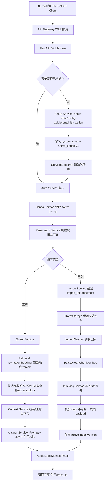

## 2. Setup 初始化模块

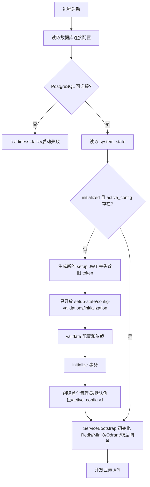

关键点：

- 数据库连接失败时不进入 setup mode。
- 未初始化时只开放 setup-state、setup-config-validations、setup-initialization。
- 初始化成功且 ServiceBootstrap 全部通过后才开放普通业务 API。
- setup JWT 只能访问初始化接口，不能访问普通业务 API 或管理员 API。

## 3. Auth 认证模块

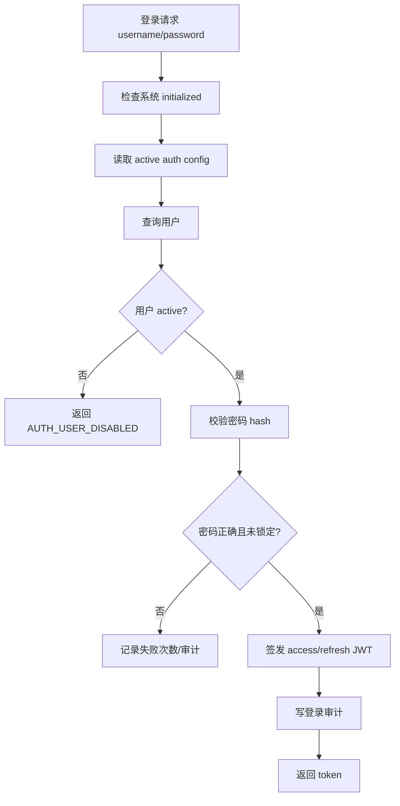

关键点：

- Auth Service 只负责账号、密码、会话和 JWT。
- JWT 不保存完整权限上下文。
- 资源访问权限由 Permission Service 构建和校验。

## 4. Org 组织模块

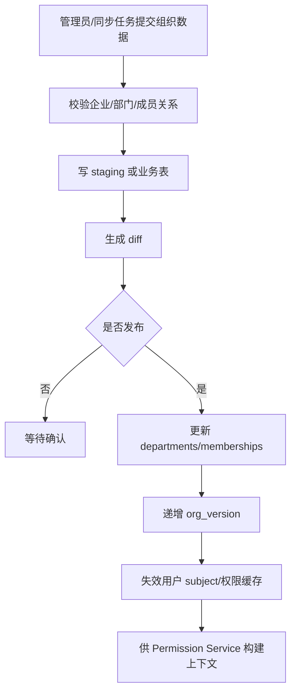

关键点：

- 最小生产阶段组织结构收敛为企业、部门、成员三层。
- 部门不建模上下级递归。
- 查询权限只使用用户直接所属部门和企业 ID。

## 5. Permission 权限模块

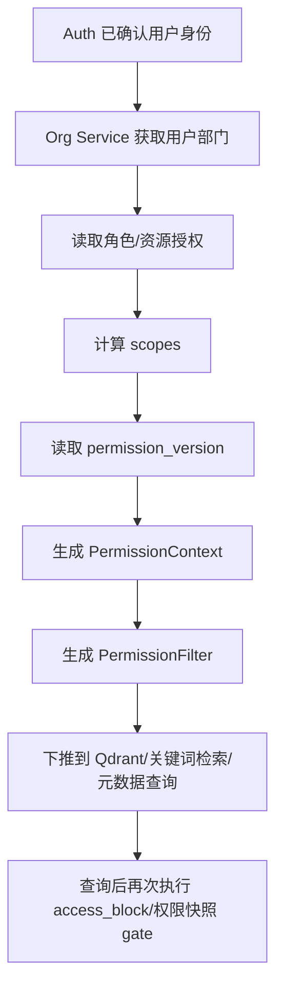

关键点：

- 权限由 RBAC 和文档可见性共同构成。
- 文档可见性只支持 `department` 和 `enterprise`。
- 权限过滤条件必须同时用于向量召回、关键词召回和元数据召回。
- 索引权限版本落后时必须拒绝候选或回源确认，不能直接放行。

## 6. Config 配置模块

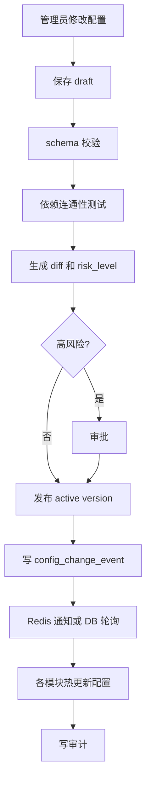

关键点：

- 业务模块不得直接从环境变量读取 Redis、MinIO、Qdrant、模型服务或业务策略。
- 高风险配置必须审批。
- 冷启动时 active config 不可用必须拒绝服务。
- 运行期热更新失败时，可以使用最近一次已加载成功的 active config。

## 7. Import 导入模块

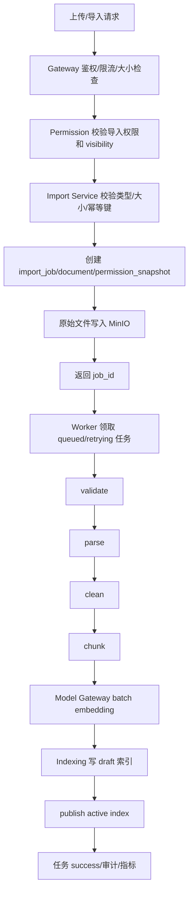

关键点：

- HTTP 请求只创建导入任务并返回 `job_id`。
- Worker 基于 PostgreSQL 任务表领取任务。
- 每个阶段独立推进状态，支持重试、续约和崩溃接管。
- 发布前 `document.index_status` 不能变为 `indexed`，`chunk_index_refs.visibility_state` 必须保持 `draft`。

## 8. Indexing 索引模块

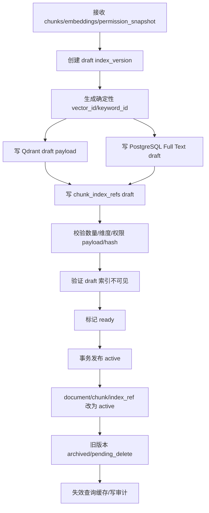

关键点：

- Qdrant 和关键词索引必须写入同一套权限字段。
- draft 和 ready 索引不得被查询命中。
- `chunk_index_refs` 是索引事实账本。
- 权限收紧或删除时必须先阻断查询，再异步物理删除索引。

## 9. Query 查询入口模块

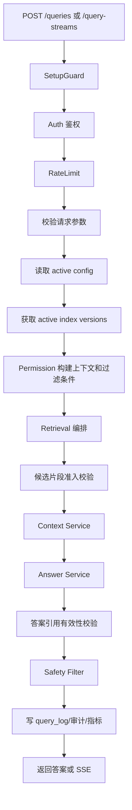

关键点：

- 查询请求必须带 request context，包括 `request_id`、`trace_id`、`config_version`、`permission_version` 和 active index 版本信息。
- 查询缓存命中后仍要执行 access block 和引用有效性轻量校验。
- 流式响应开始前必须完成权限过滤、active index、access block 和候选引用来源准入校验。
- 严格引用模式下，不能输出未经引用校验的最终 token。

## 10. Retrieval / Context / Answer 核心 RAG 模块

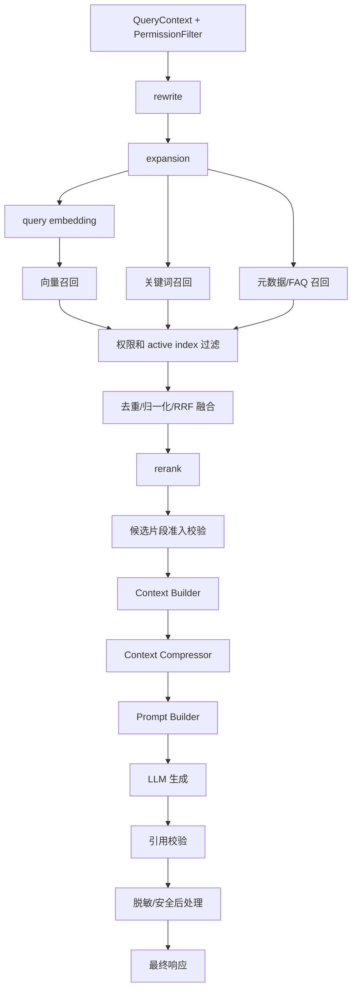

关键点：

- rewrite 失败时回退原始查询，不能覆盖用户显式过滤条件。
- expansion 不能扩大权限范围。
- 向量召回、关键词召回、元数据召回都必须下推权限过滤和 active index 可见性过滤。
- rerank 超时后使用融合分数降级。
- LLM 超时时返回检索结果和引用。

## 11. Model Gateway 模型网关

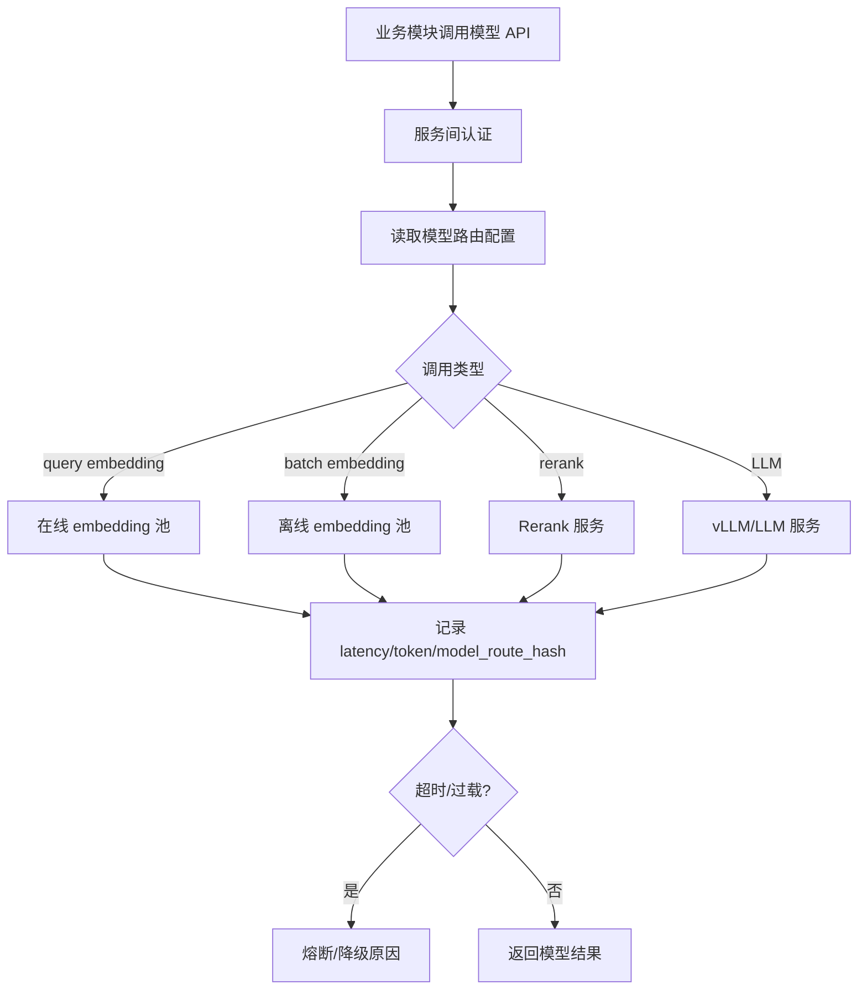

关键点：

- 业务模块只调用 Model Gateway，不直接调用 vLLM、TEI 或外部模型 SDK。
- 在线 embedding 和离线 batch embedding 分池。
- 每次路由必须输出 `model_route_hash`，用于查询日志和缓存 key。
- embedding 模型版本、维度和 normalize 配置必须和索引兼容。

## 12. Audit / Observability 审计可观测模块

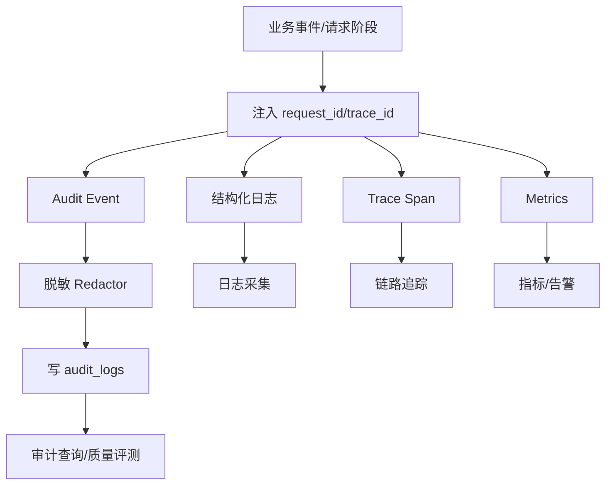

关键点：

- 普通日志禁止记录密码、token、secret value、完整 prompt、文档原文和未脱敏个人信息。
- Prompt 相关日志默认只记录模板 ID、模板版本、prompt hash、变量摘要和模型版本。
- 查询、导入、权限变更、配置发布、初始化、登录和高风险模型调用都必须审计。

## 13. API Gateway 与高并发模块

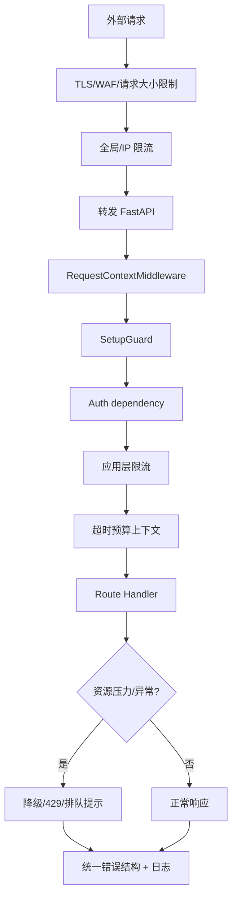

关键点：

- Gateway 层处理 TLS、WAF、请求大小限制、全局限流和 IP 限流。
- FastAPI Middleware 注入 request context、setup guard、鉴权、应用限流和超时上下文。
- 导入积压时应降低导入速度，不能影响查询优先级。
- LLM、embedding batch、Qdrant 写入、PostgreSQL 连接池都需要反压策略。

## 14. Core Data Model 数据生命周期模块

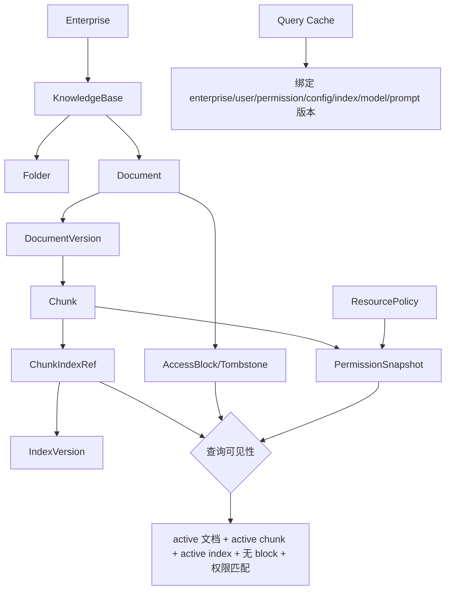

关键点：

- PostgreSQL 是业务事实源，Qdrant、关键词索引和缓存都是派生数据。
- 查询可见性必须同时满足业务状态、索引状态、权限快照和删除阻断。
- 权限收紧和文档删除必须 fail closed。
- 查询响应中的每个 citation 必须回溯到 active chunk、document version 和对象存储原文。

## 15. 部署与运维流程

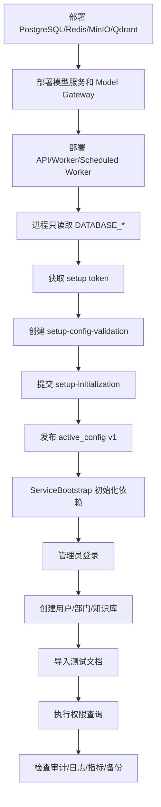

关键点：

- API、Worker 和 Model Gateway 管理进程的 `.env` 只保存数据库连接内容。
- 初始化完成后 setup-initialization 写接口必须关闭，setup token 必须失效。
- 上线前必须验证权限过滤下推、draft 索引不可见、删除阻断、缓存隔离和 LLM 降级。

## 16. 设计一致性说明

当前设计文档中，根目录总设计曾出现“岗位级、项目级、文档级权限”等更复杂表达；拆分后的模块设计已经收敛为：

- 组织模型：企业、部门、成员。
- 文档可见性：`department` 和 `enterprise`。
- 管理授权：通过 RBAC 角色和作用域控制。
- 查询权限：通过 `visibility = enterprise OR owner_department_id IN user.departments` 下推到检索层。

后续实现建议以拆分后的模块文档为准。这个收敛版本更适合最小生产落地，也更容易保证权限过滤下推、索引 payload 一致、查询缓存隔离和故障时 fail closed。
