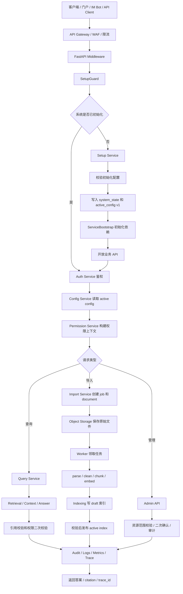

# Little Bear 项目设计流程梳理

本文基于当前 `docs/` 下的设计文档整理 Little Bear 的设计思路、核心流程、模块关系和落地顺序，作为正式编码、评审、联调和验收时的总览入口。

相关依据：

- `docs/README.md`
- `docs/架构设计文档.md`
- `docs/MVP范围说明.md`
- `docs/项目执行流程图.md`
- `docs/modules/00-公共实现约束.md`
- `docs/contracts/openapi.yaml`
- `docs/contracts/database-schema.md`
- `docs/contracts/config.schema.json`
- `docs/contracts/权限矩阵.md`
- `docs/contracts/状态机设计.md`
- `docs/contracts/审计事件字典.md`
- `docs/testing/测试计划.md`
- `docs/admin/管理后台交互契约.md`
- `docs/development/本地开发环境.md`
- `docs/planning/正式编码前任务追踪.md`

## 1. 项目定位

Little Bear 当前设计主线是企业内部高并发生产级 RAG 后端系统。

第一阶段不是做通用 Agent 平台，也不是做复杂多 Agent 编排，而是先跑通一条可上线验证的企业知识问答闭环：

```text
初始化系统
-> 登录
-> 组织 / 用户 / 权限
-> 知识库
-> 文档导入
-> 索引发布
-> 权限过滤查询
-> 带 citation 的答案
-> 审计可追踪
```

P0 目标是证明以下能力成立：

- 系统可以在只有数据库连接配置的情况下完成首次初始化。
- 业务配置通过初始化接口写入数据库，并发布为 `active_config v1`。
- 用户只能检索自己有权限访问的文档和 chunk。
- 文档导入异步执行，HTTP 请求只创建任务。
- draft 索引不会被查询命中，只有 active index 可以服务查询。
- 查询结果必须带 citation，citation 可以回溯到文档版本、页码和 chunk。
- 查询、导入、权限变更、配置发布、模型调用和高风险管理操作都可审计。
- 本地开发和 P0 测试可以使用模型 mock 跑通，不依赖真实大模型。

## 2. 总体设计思路

当前设计围绕“可控、可审计、可恢复”的企业内部 RAG 后端展开。核心取舍如下。

### 2.1 先收敛业务闭环，再扩展平台能力

P0 只保留“文档导入到权限过滤问答”的最小闭环。外部组织同步、多级部门权限、指定用户共享、复杂审批流、配置回滚、离线评测平台、真实多模型调度和复杂 Agent 编排都被明确放到后续阶段。

这样可以先把最容易出安全事故和工程返工的部分固化下来：

- 初始化配置边界。
- 权限模型。
- 数据模型。
- 导入和索引状态机。
- 查询可见性 gate。
- 审计和脱敏规则。
- OpenAPI、数据库 schema、权限矩阵和测试计划。

### 2.2 采用模块化单体 + 轻量 Worker

最小生产阶段采用 FastAPI 模块化单体承载 API 和核心业务模块，用独立 Worker 处理导入任务。

```text
FastAPI API
  - Setup Service
  - Auth Service
  - Org Service
  - Permission Service
  - Config Service
  - Import Service
  - Indexing Service
  - Query Service
  - Retrieval / Context / Answer
  - Audit Service

Import Worker
  - parse
  - clean
  - chunk
  - embed
  - write draft index
  - publish active index
```

当前不急于拆微服务。后续如果 Query、Import、Permission、Config 或 Model Gateway 成为独立热点，再按模块边界拆出服务。

### 2.3 启动配置最小化，业务配置全部进入 active config

API、Worker 和 Model Gateway 管理进程启动时只允许读取数据库连接配置和进程参数。

允许从启动配置读取：

- `DATABASE_URL`
- 数据库连接超时、连接池、SSL mode 等数据库参数
- `APP_ENV`、`SERVICE_NAME`、`SERVICE_PORT`、`LOG_LEVEL` 等进程参数

禁止从启动配置读取：

- Redis 连接。
- MinIO、Qdrant、模型网关地址。
- JWT 签名密钥。
- 检索、权限、缓存、限流、降级、审计等业务策略。

这些业务配置必须通过初始化接口写入数据库，并由 Config Service 读取 `active_config v1`。ServiceBootstrap 再基于 active config 初始化 Redis、Secret Store、Object Storage、Vector Store、Keyword Search、Model Gateway、Audit Sink 和 Rate Limiter。

### 2.4 权限必须前置并下推到检索层

权限不是查询完成后的结果过滤，而是检索阶段的输入条件。

查询链路必须先由 Permission Service 构建权限上下文，再生成统一的 `PermissionFilter`，并同时下推到：

- Qdrant 向量召回。
- PostgreSQL Full Text 关键词召回。
- 元数据查询。

候选进入上下文前还必须做二次准入校验：

- `document.lifecycle_status = active`
- `document.index_status = indexed`
- `chunk.status = active`
- `index_version.status = active`
- `chunk_index_ref.visibility_state = active`
- 不存在有效 `access_block`
- 索引权限版本未落后，或已完成回源确认

权限判断不能依赖 LLM，JWT 中也不能保存完整权限上下文。

### 2.5 PostgreSQL 是事实源，索引和缓存是派生数据

PostgreSQL 保存用户、组织、权限、配置、文档、chunk、任务、索引账本、审计和查询日志，是业务事实源。

Qdrant、关键词索引、MinIO 对象和 Redis 缓存都是派生数据或外部存储。任何可见性判断都不能只依赖派生索引。

关键设计包括：

- `documents`、`chunks`、`permission_snapshots`、`index_versions`、`chunk_index_refs` 和 `access_blocks` 共同决定查询可见性。
- `chunk_index_refs` 是索引事实账本。
- draft / ready 索引不能被查询命中。
- 文档删除和权限收紧必须先写 access block，先阻断查询，再异步物理删除索引或对象。
- 查询缓存 key 必须包含企业、用户或权限过滤、请求过滤、配置版本、索引版本、模型路由和 Prompt 版本。

### 2.6 模型能力通过 Model Gateway 统一访问

业务模块不直接调用 vLLM、TEI 或第三方模型 SDK。

所有模型能力通过 Model Gateway 访问：

- query embedding
- batch embedding
- rerank
- LLM chat completion
- model health
- model catalog

P0 可以使用 `tools/mock_model_gateway.py` 提供 mock 能力。这样可以先稳定接口、日志、降级和测试，再接入真实模型服务。

### 2.7 所有高风险操作必须可确认、可审计、可补偿

高风险操作包括初始化提交、setup JWT 签发和轮换、管理员创建或删除、角色绑定、权限扩大或收紧、配置发布、文档删除、知识库删除、索引重建和发布。

这些操作必须具备：

- 后端权限校验。
- 资源范围校验。
- 二次确认或等价 CLI 确认机制。
- 审计日志。
- 失败补偿策略。
- 缓存失效或 access block 等阻断机制。

前端菜单隐藏不是安全边界。

## 3. 文档驱动的设计流程

当前项目的设计流程可以理解为从业务闭环向工程契约逐层收敛。

```text
业务目标
  -> MVP 范围
  -> 架构风格
  -> 公共实现约束
  -> 工程契约
  -> 模块设计
  -> 执行流程
  -> 本地环境
  -> 测试与验收
  -> 正式编码
```

### 3.1 冻结 MVP 范围

输入文档：

- `docs/MVP范围说明.md`
- `docs/planning/正式编码前任务追踪.md`

设计动作：

- 明确 P0 必须跑通的端到端路径。
- 明确 P0 暂不实现范围，避免过早引入复杂能力。
- 将每个 P0 功能映射到 API、数据表、状态机和测试用例。

输出结果：

- P0 只做初始化、认证、组织权限、知识库文档、导入索引、权限过滤查询、citation、审计和本地 mock 验收。
- 复杂 Agent、多 Agent、完整审批流、外部组织同步、真实模型高可用调度等不作为 P0 编码门禁。

### 3.2 固化架构风格和分层约束

输入文档：

- `docs/架构设计文档.md`
- `docs/modules/00-公共实现约束.md`

设计动作：

- 确定模块化单体 + 轻量 Worker。
- 确定 ports / adapters 边界。
- 明确禁止跨层调用和外部 SDK 泄漏。
- 明确事务边界、幂等、配置读取、错误结构、日志和测试分层。

输出结果：

```text
api -> module service -> domain policy -> ports/interfaces -> adapters
```

禁止：

```text
api -> qdrant/minio/model sdk
api -> raw SQL
worker -> FastAPI route function
permission -> LLM
LLM -> permission decision
```

### 3.3 先做工程契约，再进入业务编码

输入文档：

- `docs/contracts/openapi.yaml`
- `docs/contracts/config.schema.json`
- `docs/contracts/config-schema.md`
- `docs/contracts/database-schema.md`
- `docs/contracts/权限矩阵.md`
- `docs/contracts/状态机设计.md`
- `docs/contracts/审计事件字典.md`
- `docs/testing/测试计划.md`

设计动作：

- 固化 API request / response / error schema。
- 固化 active config schema。
- 固化数据库表、枚举、索引和约束。
- 固化 endpoint 级权限矩阵。
- 固化核心状态机和补偿策略。
- 固化审计事件、summary_json 和脱敏规则。
- 固化 P0 自动化测试边界。

输出结果：

- 后端实现、前端联调和 contract 测试都以 OpenAPI 为准。
- 权限校验以权限矩阵为准。
- 状态推进以状态机文档为准。
- 审计和脱敏以审计事件字典为准。
- 初始化配置以 JSON Schema 为准。

### 3.4 按模块实现业务能力

输入文档：

- `docs/modules/01-初始化服务设计实现文档.md`
- `docs/modules/02-认证服务设计实现文档.md`
- `docs/modules/03-组织服务设计实现文档.md`
- `docs/modules/04-权限服务设计实现文档.md`
- `docs/modules/05-配置服务设计实现文档.md`
- `docs/modules/06-导入服务与工作进程设计实现文档.md`
- `docs/modules/07-索引服务设计实现文档.md`
- `docs/modules/08-查询服务设计实现文档.md`
- `docs/modules/09-检索上下文与答案生成设计实现文档.md`
- `docs/modules/10-模型网关设计实现文档.md`
- `docs/modules/11-审计与可观测性设计实现文档.md`
- `docs/modules/12-接口网关与高并发设计实现文档.md`
- `docs/modules/13-部署与运维设计实现文档.md`
- `docs/modules/14-核心数据模型设计实现文档.md`
- `docs/modules/15-前端与管理后台API设计实现文档.md`

设计动作：

- 每个模块内部保持 service / policy / repository / schema / errors / events 分层。
- 模块之间通过 service 或 ports 交互。
- 外部依赖通过 adapters 替换。
- 每个模块都要覆盖权限、审计、错误码、幂等和测试。

输出结果：

- 模块职责清晰。
- 关键链路可调试。
- 外部依赖可替换。
- 后续拆服务有自然边界。

### 3.5 形成执行流程和验收路径

输入文档：

- `docs/项目执行流程图.md`
- `docs/development/本地开发环境.md`
- `docs/testing/测试计划.md`
- `docs/operations/部署与发布检查清单.md`

设计动作：

- 把初始化、认证、导入、索引、查询、权限变更、删除阻断、配置发布和审计串成可复现流程。
- 本地使用 Docker Compose 启动 PostgreSQL、Redis、MinIO、Qdrant 和 Model Gateway mock。
- P0 验收不依赖真实大模型。

输出结果：

- 本地可以从空数据库完成初始化。
- 可以创建用户、部门、知识库。
- 可以上传文档并完成 active index 发布。
- 可以验证有权用户可查询、无权用户不可查询。
- 可以验证删除阻断、权限收紧、缓存隔离和模型降级。

## 4. 系统总流程



## 5. 核心业务流程

### 5.1 启动与初始化流程

FastAPI API 采用 ASGI 运行模型，本地和容器内均通过 `uvicorn` 启动：

```bash
PYTHONPATH=apps/api python3 -m uvicorn app.main:app --host ${API_HOST:-0.0.0.0} --port ${API_PORT:-8000}
```

本地开发统一使用 `make api` 封装该命令，生产部署可以由镜像入口或编排系统执行等价 `uvicorn` 命令。`uvicorn` 只负责运行 ASGI 应用和事件循环，业务依赖仍必须在 PostgreSQL 可连接后通过 `active_config v1` 初始化。

```text
1. 进程启动，只读取数据库连接配置和进程参数。
2. PostgreSQL 不可连接时，启动失败或 readiness=false，不进入 setup mode。
3. PostgreSQL 可连接后读取 system_state 和 active_config_version。
4. 未初始化时进入 setup_required，只开放 setup-state、setup-config-validations、setup-initialization 和 health。
5. 受控 CLI 签发一次性 setup JWT。
6. setup-config-validations 校验初始化 payload、Secret ref 和依赖连通性。
7. setup-initialization 创建首个管理员、默认企业、默认部门、内置角色和 active_config v1。
8. ServiceBootstrap 基于 active config 初始化 Redis、Secret Store、MinIO、Qdrant、Keyword Search、Model Gateway、Audit Sink、Rate Limiter。
9. 所有关键模块 ready 后开放业务 API。
10. 初始化完成后 setup 写接口返回 SETUP_CLOSED，setup JWT 失效。
```

关键约束：

- 数据库连接失败不能进入 setup mode。
- 冷启动时 active config 不可用必须拒绝服务。
- 不能回退读取环境变量中的业务配置。
- setup JWT 不能访问普通业务 API、管理员 API 或服务间 API。

### 5.2 认证、组织和权限流程

```text
1. 用户登录，Auth Service 校验本地账号和密码。
2. 签发 access / refresh JWT，并保存 jti 状态。
3. 业务请求进入 Auth Middleware，校验 token 类型和有效状态。
4. Permission Service 从用户、部门、角色绑定、资源策略和权限版本构建 PermissionContext。
5. 查询和资源读取请求生成 PermissionFilter。
6. 管理请求执行 scope 校验和资源范围校验。
7. 权限变更后递增 permission_version，失效权限缓存和查询缓存。
```

关键约束：

- JWT 中不保存完整权限上下文。
- Auth Service 不直接决定资源权限。
- P0 组织模型只有企业、部门、成员三层。
- P0 文档可见性只支持 `department` 和 `enterprise`。
- 指定用户共享、项目组共享、自定义组织 ACL 必须拒绝。

### 5.3 知识库、文档导入和索引发布流程

```text
1. 用户或管理员提交导入请求。
2. API 校验鉴权、scope、资源范围、文件大小和 idempotency_key。
3. Import Service 创建 document、document_version、permission_snapshot 和 import_job。
4. 原始文件写入对象存储。
5. HTTP 返回 job_id。
6. Worker 基于 PostgreSQL 任务表领取 queued / retrying 任务。
7. Worker 阶段化执行 validate、parse、clean、chunk、embedding。
8. Indexing Service 写入 Qdrant draft 向量索引和 PostgreSQL draft 关键词索引。
9. 发布前校验 chunk 数量、向量维度、payload hash、权限字段和 draft 不可见。
10. 原子发布 active index version。
11. document / chunk / chunk_index_refs 更新为 active。
12. 旧索引 archived 或 pending_delete。
13. 写入审计、日志、指标，并失效相关查询缓存。
```

关键约束：

- HTTP 只创建任务，不执行长耗时导入。
- Worker 每个阶段独立提交状态，支持重试和崩溃接管。
- draft 和 ready 索引不能被查询命中。
- Qdrant 和关键词索引必须写入同一套权限字段。
- 索引发布失败不能影响旧 active index。

### 5.4 查询、检索、上下文和答案流程

```text
1. 用户提交 /queries 或 /query-streams。
2. SetupGuard、Auth、RateLimit 和请求参数校验。
3. 构建 RequestContext，包含 request_id、trace_id、config_version、permission_version 和 active index 信息。
4. Permission Service 构建权限上下文和检索过滤条件。
5. Query rewrite 和 expansion。
6. query embedding。
7. 向量召回、关键词召回、元数据召回，并下推权限过滤和 active index 过滤。
8. 候选去重、归一化、融合。
9. rerank。
10. 候选片段准入校验：权限、文档状态、chunk 状态、active index、access block、权限快照。
11. Context Builder 组装上下文和 citation 映射。
12. Prompt Builder 构造 Prompt。
13. Answer Service 调用 LLM。
14. 引用校验和权限二次校验。
15. 脱敏、安全后处理、写查询日志、审计、指标。
16. 返回答案、citation、置信度、trace_id 和降级状态。
```

降级规则：

- rewrite 失败时回退原始查询。
- embedding 失败时降级关键词检索。
- rerank 超时时使用融合分数。
- LLM 超时时返回检索结果和 citation。
- 任何降级都必须写入响应、查询日志、模型调用日志和审计。

流式响应约束：

- 流式响应开始前必须完成权限过滤、active index、access block 和候选引用来源准入校验。
- 严格引用模式下，不能输出未经引用校验的最终答案 token。

### 5.5 权限收紧和删除阻断流程

```text
1. 管理员提交权限收紧或删除操作。
2. 后端执行 access_token、scope、资源范围和二次确认校验。
3. 事务内写 access_block 或 tombstone。
4. 递增权限版本，失效权限缓存和查询缓存。
5. 创建异步索引刷新、删除或重建任务。
6. Worker 刷新索引 payload 或删除派生索引和对象。
7. 失败进入重试或人工处置。
8. 审计记录操作、影响范围、补偿策略和结果。
```

关键约束：

- 权限收紧和删除必须 fail closed。
- 即使 Qdrant、关键词索引或对象存储物理删除失败，查询也必须立即被阻断。
- 旧缓存不能跨权限版本继续复用。

### 5.6 配置发布和热更新流程

```text
1. 管理员保存配置 draft。
2. Config Service 执行 schema 校验。
3. 执行依赖连通性测试。
4. 生成 diff 和 risk_level。
5. 高风险配置需要确认或审批。
6. 发布 active version。
7. 写 config_change_event 和审计。
8. 通过 Redis 通知或 DB 轮询触发模块热更新。
9. 热更新失败时保留最近一次已成功加载的 active config。
10. 冷启动时 active config 不可用必须拒绝服务。
```

P0 只要求 active config 读取、基础版本管理、校验和发布，不实现完整审批、复杂 diff 和通用回滚平台。

### 5.7 审计与可观测流程

```text
1. 请求进入时生成或透传 request_id 和 trace_id。
2. 业务阶段写结构化日志和 trace span。
3. 关键行为写 audit event。
4. 查询写 query_log。
5. 模型调用写 model_call_log。
6. 指标记录 latency、status、error_code、degrade_reason、token 用量等。
7. 管理后台通过受控接口查询审计、查询日志和模型调用日志。
```

禁止进入普通日志、API 响应和审计摘要的内容：

- 密码。
- token 明文。
- secret value。
- 完整 prompt。
- 文档原文。
- 未脱敏个人敏感信息。

Prompt 相关日志默认只记录模板 ID、模板版本、prompt hash、变量摘要和模型版本。

## 6. 模块职责关系

| 模块 | 核心职责 | 关键输出 |
| --- | --- | --- |
| Setup Service | 首次初始化、setup JWT、初始化状态机 | `system_state`、首个管理员、默认组织、`active_config v1` |
| Config Service | active config 读取、校验、发布、缓存、热更新 | `config_version`、模块运行配置 |
| Auth Service | 账号、密码、登录、JWT、refresh rotation | access / refresh JWT、当前用户身份 |
| Org Service | 企业、部门、用户成员关系 | 用户部门、组织版本 |
| Permission Service | RBAC、资源策略、权限上下文、过滤条件 | `PermissionContext`、`PermissionFilter` |
| KnowledgeBase / Document | 知识库、文件夹、文档元数据、版本和状态 | document、document_version、visibility |
| Import Service | 导入任务创建、幂等、任务状态入口 | `import_job`、document 初始状态 |
| Import Worker | 异步解析、清洗、切块、embedding、索引阶段推进 | chunks、embeddings、阶段状态 |
| Indexing Service | draft 索引写入、校验、active 发布、回滚和阻断 | `index_version`、`chunk_index_refs` |
| Query Service | 查询入口、上下文、超时预算、流式响应 | 查询响应、SSE 事件 |
| Retrieval | rewrite、召回、融合、rerank | 候选 chunk |
| Context Service | 上下文组装、压缩、citation 映射 | 引用上下文 |
| Answer Service | Prompt 构造、LLM 调用、引用校验 | 带 citation 的答案 |
| Model Gateway | Embedding、Rerank、LLM 的统一访问层 | 模型响应、模型调用日志 |
| Audit / Observability | 审计、日志、指标、Trace、脱敏 | audit_logs、query_logs、model_call_logs |
| API Gateway / Middleware | 请求入口、SetupGuard、Auth、限流、超时 | 统一错误结构、request context |

## 7. 建议编码顺序

当前设计文档建议按以下顺序进入正式编码：

1. 工程骨架：FastAPI、统一错误结构、request_id、trace_id、日志中间件。
2. 数据库基础：SQLAlchemy、Alembic、事务管理、repository 基类。
3. 配置契约：初始化配置 schema、`active_config v1` schema、Secret 引用、模型 mock 配置。
4. Setup Service：初始化状态、setup JWT、初始化配置校验、`active_config v1` 发布。
5. Config Service：active config 读取、缓存、版本和发布。
6. Auth Service：用户、密码、登录、refresh token rotation、JWT 状态。
7. Org Service：企业、部门、成员关系、组织版本。
8. Permission Service：角色、绑定、权限上下文、资源权限策略。
9. KnowledgeBase / Document 元数据。
10. Import Service 与 Worker：任务创建、领取、解析、切块、embedding。
11. Indexing Service：draft 写入、校验、active 发布、兼容性校验和删除阻断。
12. Query Service：查询入口、权限过滤、召回、rerank、上下文、答案和 citation。
13. Audit / Observability：P0 审计事件、查询日志、模型调用日志、基础指标。
14. P0 管理后台 API 按 OpenAPI 补齐。

这个顺序的核心逻辑是：

- 先搭可观测和错误结构，否则后续排障困难。
- 先落数据库和契约，否则模块接口会反复变。
- 先完成初始化和配置，否则业务模块没有合法运行配置来源。
- 先完成认证、组织和权限，再实现文档导入和查询，避免查询链路后补权限。
- 先完成导入和 active index，再做完整查询和答案。
- 审计和管理后台 API 贯穿实现，但在 P0 后段补齐展示和查询能力。

## 8. 本地开发和验收流程

本地基础设施由 `docker-compose.yml` 和 `Makefile` 管理：

```text
PostgreSQL
Redis
MinIO
Qdrant
Model Gateway mock
```

推荐本地验收路径：

```text
1. make env
2. make up
3. make health
4. 启动 API，确认只读取 DATABASE_* 和进程参数。
5. GET /internal/v1/setup-state 返回未初始化。
6. 使用受控 CLI 签发 setup JWT。
7. POST /internal/v1/setup-config-validations 校验本地初始化 payload。
8. PUT /internal/v1/setup-initialization 发布 active_config v1。
9. GET /health/ready 返回 ready。
10. 管理员登录。
11. 创建部门、用户、角色绑定和知识库。
12. 上传文档并创建 import_job。
13. Worker 完成导入、draft 索引写入和 active index 发布。
14. 有权限用户查询并返回答案和 citation。
15. 无权限用户无法召回部门文档。
16. 验证权限收紧、文档删除、缓存隔离和模型 mock 降级。
17. 检查审计日志、查询日志、模型调用日志和结构化日志。
```

## 9. P0 验收重点

功能验收：

- 空数据库可以完成首次初始化。
- 初始化完成后业务 API 可用，初始化写接口关闭。
- 用户、部门、角色、知识库和文档导入闭环可用。
- Worker 可以把文档处理到 active index。
- 查询返回答案和 citation。
- 模型 mock 异常时可以按策略降级。

安全验收：

- 所有业务 API 默认需要 `Authorization: Bearer <jwt>`。
- setup JWT 不能访问业务、管理或服务间接口。
- 权限过滤必须下推到向量检索和关键词检索。
- 权限判断不依赖 LLM。
- 删除和权限收紧必须 fail closed。
- 缓存不能跨用户、跨租户、跨权限上下文复用。
- 日志、响应和审计摘要不得泄露敏感信息。

工程验收：

- OpenAPI 覆盖所有 P0 API。
- 初始化配置和 active config 有 JSON Schema。
- 数据库表、枚举、约束、索引和状态机明确。
- 每个写接口都有权限矩阵、审计要求和补偿策略。
- 自动化测试覆盖初始化、认证、权限、导入、索引、查询、删除阻断和模型降级。
- 本地环境不依赖真实大模型即可跑通 P0。

## 10. 当前设计的关键风险和控制点

| 风险 | 可能影响 | 设计控制点 |
| --- | --- | --- |
| 配置散落在环境变量 | 部署不可审计、恢复困难 | 启动层只读数据库连接，业务配置统一走 active config |
| 权限只在召回后过滤 | 越权召回、缓存串权 | PermissionFilter 下推向量、关键词和元数据召回 |
| 索引状态不清晰 | draft 数据被查询命中 | `index_versions` + `chunk_index_refs` 管理 draft / ready / active |
| 删除先删索引失败 | 已删除文档仍可见 | 先写 access block，再异步物理删除 |
| 模型服务不稳定 | 查询不可用或无引用答案 | embedding / rerank / LLM 分阶段降级，响应和审计记录降级原因 |
| 缓存 key 不完整 | 跨用户或跨权限复用 | 缓存 key 包含用户、权限过滤、配置、索引、模型路由和 Prompt 版本 |
| 日志泄露敏感信息 | 合规和安全风险 | 审计事件字典和脱敏规则约束日志、响应和审计展示 |
| 状态机不明确 | Worker 重试和补偿混乱 | 状态机文档定义允许迁移、重试和补偿策略 |
| 真实模型过早接入 | 开发测试不稳定 | P0 使用 Model Gateway mock 或单一 adapter |
| 管理后台只做菜单隐藏 | 后端越权风险 | 后端按权限矩阵校验 token、scope 和 resource_check |

## 11. 后续落地原则

正式编码时建议坚持以下原则：

- 新功能必须能映射到 OpenAPI、数据库 schema、权限矩阵、状态机、审计事件和测试用例。
- 不影响 P0 验收路径的能力进入 P1 或后续版本。
- 不允许为了方便绕过 Config Service、Permission Service 或 Model Gateway。
- 不允许把外部 SDK 泄漏到 API route 或业务策略层。
- 不允许把权限判断交给 LLM。
- 不允许把 secret、token、完整 prompt 或文档原文写入普通日志。
- 高风险操作必须具备确认、审计、补偿和失败可恢复路径。
- 所有降级都必须可观测、可解释、可测试。
- 项目代码中的注释、docstring 和面向开发者的说明默认使用中文，并优先解释业务约束、权限边界、事务边界和安全限制。

## 12. 一句话总结

Little Bear 当前设计不是先追求复杂智能体能力，而是先把企业 RAG 后端最关键的工程底座跑通：初始化可控、配置可审计、权限不越界、导入可恢复、索引可发布、查询带引用、失败可降级、操作可追踪。后续 Agent、复杂工作流、多模型调度和高级评测能力，都应建立在这个稳定闭环之上。
